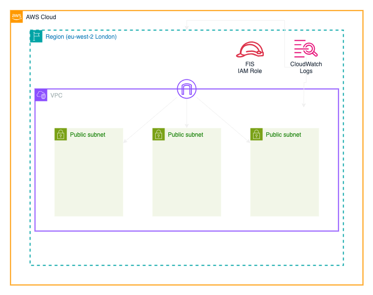

# Init - Creating base infrastructure

For several steps in this workshop, we'll be using AWS. To get started, we need to create some base infrastructure.

We're going to create the infrastructure below using the terraform files in this folder and `../modules/vpc`.



By default, this will deploy in the `eu-west-2` region.

We'll not cover everything we create, but basically we're going to create a VPC to isolate our resources. Inside this we'll create a public subnet in each avaliability zone in the region, and an internet gateway to allow our resources to access the internet.

If you were doing this in a production environment, you'd probably want to add more security, such as Network ACLs, Security Groups, and maybe private subnets, but for this workshop we'll keep it simple.

## AWS Access
First, we'll need AWS credentials - use your preferred method to set these up. (If you're running this as part of the live session, we'll help you set these up.)

To check these are working, let's run the command `aws sts get-caller-identity` which should return something like:

```
% aws sts get-caller-identity
{
    "UserId": "AROAZBCDIVZPFO26N2JB3:someone@example.com",
    "Account": "630276193694",
    "Arn": "arn:aws:sts::630276193694:assumed-role/AWSReservedSSO_AdministratorAccess_a62d25a38ff49aab/someone@example.com"
}
```

## Terraform config setup
Most of the terraform files in this workshop use the same variables, so we'll create a common file to store these. Create a file `common.tfvars` in the `common` folder with the following content:

```hcl
panda_name = "<some_panda_name>"
```

If you're running this as part of the live session, replace `<some_panda_name>` with the name we'll provide you with and `<asset_bucket>` with `630895193694-eu-west-2-oct-assets`, otherwise feel free to use your own details, or similar.


## Deploying the infrastructure
Once you have a set of AWS credentials and you've setup the `common.tfvars` file, you can deploy the infrastructure by making sure you're in the `steps/init` folder.

Firstly, we need to initialise our Terraform environment by running the command `terraform init`. This will download the required providers and setup an environment ready to use.

Once initialised, it's always good practice to check our Terraform code, and we can do this with the commands `teraform plan --var-file ../common/common.tfvars`. This will show us what Terraform is going to do.

If the command runs ok, we can then apply the changes with `terraform apply --auto-approve --var-file ../common/common.tfvars`. This will create the infrastructure in the specified AWS account.

Once the command completes, you should see something like (although the actual values may  be different):

```text
Apply complete! Resources: 20 added, 0 changed, 0 destroyed.

Outputs:

fis_iam_role = "funky_fis_iam_role"
fis_log_group = "/aws/fis/funky-fis-logs"
```
:information_source: Make a note of the outputß values as we'll need these later.

## Sharing the configuration with other steps
To allow the following steps in the workshop to use configuration we've just created, we'll store the details in a Terraform statefile `statefiles/base_config.tfstate`.

<br />
<br />

---
Now, please proceed to [step 1 README](../step01/README.md), or
Back to the main [README](../../README.md) file