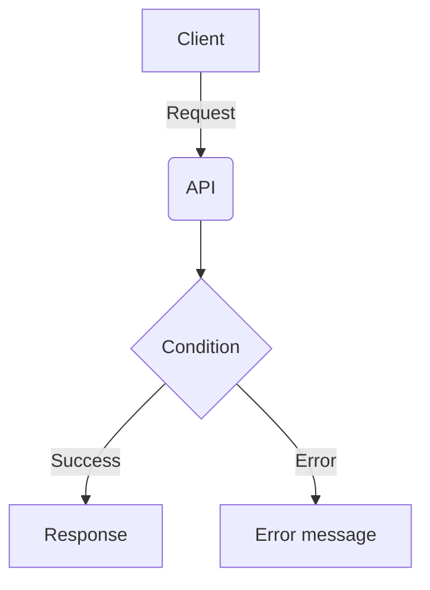

# Step 01 - Creating base infrastructure

For several steps in this workshop, we'll be using AWS. To get started, we need to create some base infrastructure.

Firstly, we're going to create a Virtual Private Cloud (VPC) to isolate our resources, and to make it simpler when we come to test later.

```mermaid
architecture-beta
    group api(logos:aws-lambda)[API]

    service db(logos:aws-aurora)[Database] in api
    service disk1(logos:aws-glacier)[Storage] in api
    service disk2(logos:aws-s3)[Storage] in api
    service server(logos:aws-ec2)[Server] in api

    db:L -- R:server
    disk1:T -- B:server
    disk2:T -- B:db
```

