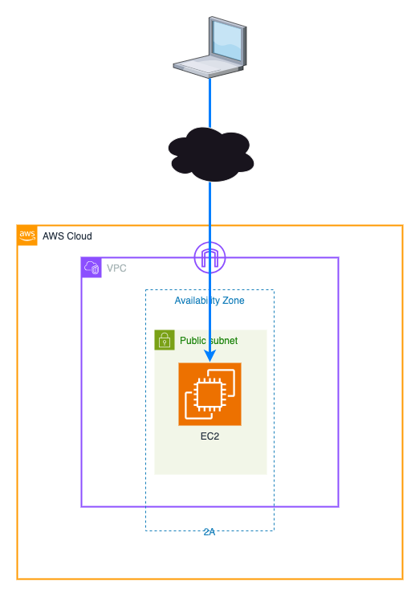
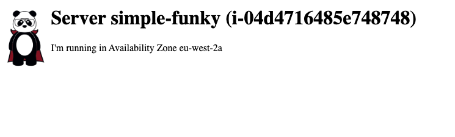
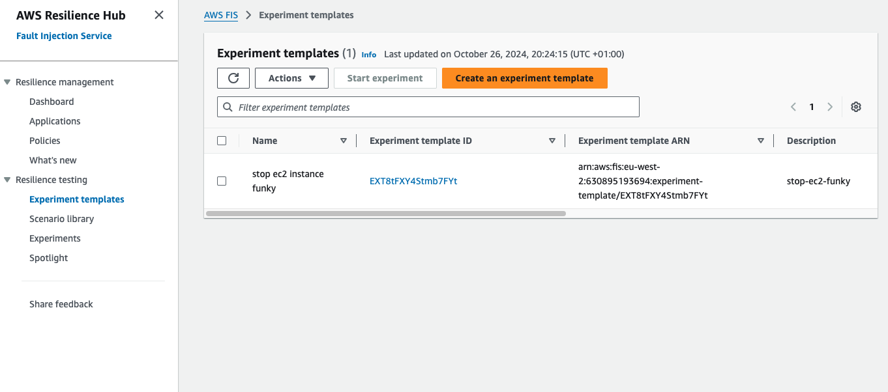

# Step 01 - First experiment with FIS, a simple single server setup

To get started, we'll need to deploy a simple server in AWS. We'll then use FIS to simulate a failure on this server.

:warning: Before you start this step, make sure you've deployed the base infrastructure in the [init](../init/README.md) step.


## Pre-requisites
Before we go further with the step, we need to ensure that 
1. We have some active AWS credentials,
1. We have deployed the base inftastructure in the [init](../init/README.md) step.
1. This deployment assumes there is a route53 hosted zone in place, pointing to the domain referenced in `variables.tf`. If you don't have a hosted zone/domain, ignore this and use the url with an IP, but be aware that the IP may change if the server is stopped and started again.

## Deploying an environment to test
To deploy the environment, we need to run the Terraform code in the `step01` directory. 

Firstly, we need to initialise our Terraform environment by running the command `terraform init`. This will download the required providers and setup an environment ready to use.

Once initialised, it's always good practice to check our Terraform code, and we can do this with the commands `teraform plan --var-file ../common/common.tfvars`. This will show us what Terraform is going to do.

If the command runs ok, we can then apply the changes with `terraform apply --auto-approve --var-file ../common/common.tfvars`. This will create the infrastructure in the specified AWS account.

Once the command completes, you should see something like (although the actual values may  be different):

```text
Apply complete! Resources: 6 added, 0 changed, 0 destroyed.

Outputs:

ec2_details = {
  "instance_az" = "eu-west-2a"
  "instance_id" = "i-08ede8fe7eb507f58"
  "instance_ip_url" = "http://18.170.32.169"
  "instance_name" = "simple-funky"
  "instance_named_url" = "http://simple-funky.devopsplayground.org"
  "instance_subnet" = "subnet-0a1170859dd348b2b"
}
subnet_details = {
  "subnet-091bafa95d412af09" = {
    "availability_zone" = "eu-west-2b"
    "cidr_block" = "10.100.1.0/24"
  }
  "subnet-0a1170859dd348b2b" = {
    "availability_zone" = "eu-west-2a"
    "cidr_block" = "10.100.0.0/24"
  }
  "subnet-0c2f0021f2a72b04b" = {
    "availability_zone" = "eu-west-2c"
    "cidr_block" = "10.100.2.0/24"
  }
}
vpc_id = "vpc-0feb32b0ebc6f9d83"
```

:information_source: Make a note of the `instance_id` in the output from your deployment as we'll need this shortly.

## What have we deployed?
For this first step, we've deployed a simple EC2 instance running a web server. The instance is in a public subnet, and has a security group allowing inbound traffic on port 80. 
The EC2 instance is configured to update route53 with the public IP address of the instance on every reboot, so we can access it via a domain name (if you have one available).

The infrastructure deployed is shown in the diagram below:




With the server deployed, we can now test it by visiting the URL in the `instance_ip_url` output. This should show a simple web page that looks something like:



(:warning: **Note**: it may take a few minutes for the server to become fully available)


## Creating our first experiment with FIS
Now that we have our server deployed, we can create our first experiment with FIS. For this we're going to simulate a failure on the server by stopping the instance.

Firstly, we need to create an experiment template within FIS. These templates describe the actions that we're going to carry out in the experiment. To do this,
we need to access FIS in the AWS console. You can do this by navigating to the [FIS console](https://eu-west-2.console.aws.amazon.com/fis/home?region=eu-west-2#/home) and selecting the `Experiment templates` option from the left-hand menu, or by entering FIS in the AWS search bar, selecting FIS and then clicking on `Experiment templates`.

Once in the `Experiment templates` page, click on the `Create experiment template` button. This will take you to the `Create experiment template` page. We're only to going to 
test against our account, so ensure that the `Account` option is selected, and click on `Confirm`.

Next we'll define our experiment template with the following steps:

1. Firstly, provide a description for the template, such as `Stop EC2 instance`, and add a name, something including your panda name at the end to make it easier to identify.
1. In the `Actions` section, click on the `Add action` button. This will open a new section where we can define the action. 
    1. In the name field, enter `stop-ec2`.
    1. Select `EC2` in the action type field, and then select `aws:ec2:stop-instances` in the action field. Depending on the action chosen, we'll see different options to complete. In this case, we're going to restart the server after 2 minutes.
    1. In the `Start instances after duration` field, enter 2 minutes. This will ensure that the instance is restarted after 3 minutes.
    1. Click on the `Save` button.
1. You'll see that in the `Targets` option it's automatically added a `Instances-Target` target. The target will depend upon the action chosen.
1. Click on `aws:ec2:instance` to specify which instance we want to stop
    1. In the `Resource IDs` field, either scroll or search in the dropdown using the instance id we noted earlier.
    1. Ensure that the field `Selection mode` contains the value `All`.
    1. Click on the `Save` button.
1. Scroll down and ensure that the `Create a new role for the experiment template` option is ticked.
1. Click on the `Create an experiment template` button, and in the warning field, enter `create` and then click the `Create an experiment template` button.

With this done, we should be able to see the experiment we just created in the `Experiment templates` page in the AWS console at https://eu-west-2.console.aws.amazon.com/fis/home?region=eu-west-2#ExperimentTemplates, looking something like:



## Running our first experiment
We now have a template we can use to initiate an experiment. From the templates page in the console, 
tick the box next to the template you just created and then click the `Start Experiment` button. For now, after this, just click on the `Start Experiment` button. We'll then be prompted to confirm we want to start the
experiment, so enter `start` in the field and click the `Start Experiment` button.

This will open the experiment page, where we can see the progress of the experiment. If you open the [EC2 instances page](https://eu-west-2.console.aws.amazon.com/ec2/home?region=eu-west-2#Instances) in a new tab, you should be able to find the instance, and after a short while see that it's stopped.

If you try to open the URL for the instance, you should see that it's no longer available. So our experiment has demonstrated that we don't have a resilient infrastructure.

If you remember, we set the experiment to restart the instance after 2 minutes. After this time, refresh the EC2 instances page, and check the public IP assigned to the instance and access the URL via that IP you should see that the instance is running again.
<br />
<br />

---
Now, please proceed to [step 2 README](../step02/README.md), or
Back to the main [README](../../README.md) file