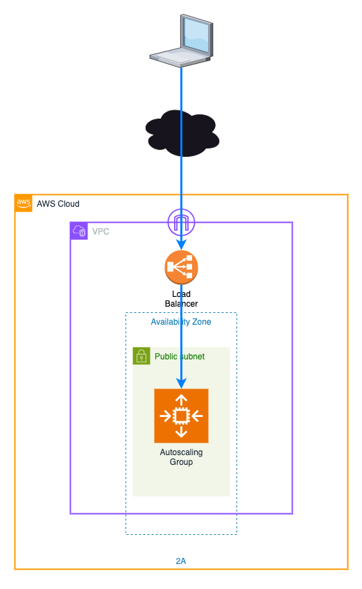
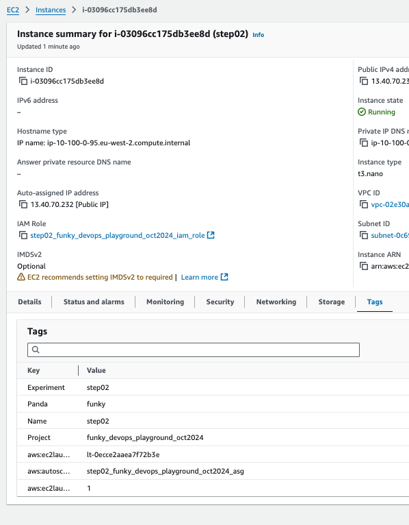

# Step 02 - improving resilience.

In [step01](../step01/README.md), we saw that a single server has very little resilience and if it fails,
we will lose access to whatever services are running on it.

Often, people will jump to a multi-server setup to improve resilience, but sometime we might have cost challenges.
If we can live with short outages, a simple solution can be to place that single server in an auto-scaling group with
a minimum and maximum of 1 instances. This means that if the server dies, health-checks will fail and a 
new server with the same configuration will be started.

Whilst not completely necessary, at this point, it's worth adding a load balancer, so that we don't need to query the server to get the IP address everytime.

With that in mind, our new architecture will look like this:


## Creating the infrastructure.
This step will be similar to the previous one, but we need to make sure we're in the `step02` directory before running the command `terraform init`, and then
`terraform apply --auto-approve --var-file ../common/common.tfvars`. This will show the output as the infrastructure is created, completing with output looking
something like:

```
pply complete! Resources: 6 added, 0 changed, 0 destroyed.

Outputs:

elb_url = "http://step02-funky-elb-746265935.eu-west-2.elb.amazonaws.com"
```

If you click on the url, you'll see a page similar to the first step. Make a note of the instance id, shown in the output, as we'll need this in the next step.

## Creating a new template
Let's revisit the FIS Experiment templates in the AWS Console (either search for FIS, or use the link https://eu-west-2.console.aws.amazon.com/fis/home?region=eu-west-2#ExperimentTemplates).

However, this time rather than using the instance id which isn't a great practice as it can change with autoscaling groups, let's look at a different option.

When we create resources, we should really always be using tags to make it easier to identify resources - this might be for cost reporting purposes, or we might have scripts we use
to manage resources. In this case, we've setup the launch template for the auto-scaling group to add tags similar to below:



So this time, rather than specifying the instance id, we can specify the tag. Let's create a new template to stop the instance.

Click on `Create an experiment template` and repeat the steps from the previous exercise as below:

1. Firstly, provide a description for the template, such as `Stop step02 EC2 instance`, and add a name, something including your panda name at the end to make it easier to identify.
1. In the `Actions` section, click on the `Add action` button. This will open a new section where we can define the action. 
    1. In the name field, enter `stop-ec2`.
    1. Select `EC2` in the action type field, and then select `aws:ec2:stop-instances` in the action field. However, this time don't select the option to restart instances as the autoscaling
    group should take care of this for us.
    1. Click on the `Save` button.
1. You'll see that in the `Targets` option it's automatically added a `Instances-Target` target. The target will depend upon the action chosen.
1. Click on `aws:ec2:instance` to specify which instance we want to stop
    1. Click on the `Resource Tags, filters and parameters` option.
    1. We want to make sure we're only targeting our own instances from this experiment, so click on the `Add new tag` button, and enter `Panda` in the Key field and your panda name in the Value field. Then click on `Add new tag`, enter `Experiment` in the Key field and `step02` in the Value field.
    1. Ensure that the field `Selection mode` contains the value `All`.
    1. Click on the `Save` button.
1. Again, we'll use the role we created at the start, so click on `Use an existing IAM role` and select the role that starts with your panda name.
1. Click on the `Create an experiment template` button, and in the warning field, enter `create` and then click the `Create an experiment template` button.

Before we run the experiment, let's look at the options we have available to us. If we look at the bottom of our experiment, we have a number of tags that will tell us about the experiment.
1. **Actions** - this tells us the actions that will be taken in the experiment.
1. **Targets** - this tells us how we'll choose the resources to be affected by the experiment.
1. **Export** - generates a CLI command that we could use to generate the command via script.
1. **Tags** - lists any tags that will be applied for the experiment run.
1. **Timeline** - this gives an estimate of how long the experiment will take to run.
1. **Schedules** - this lets us set or list when the experiment will run, if we don't want it to happen on request.

Now we have our new template, let's run the experiment. Click on `Start experiment`, and the same on the next page before entering `start` in the warning field and clicking `Start experiment`.

If we review the instance page in the EC2 console, we'll see that the instance is stopping. If we refresh the load balancer page, we'll see that the page is no longer available. After a few
minutes, the health checks on the auto-scaling group will fail, and a new instance will be started. If we refresh the load balancer page again, we'll see that the page is available again.


<br />
<br />

---
Now, please proceed to [step 2 README](../step02/README.md), or
Back to the main [README](../../README.md) file