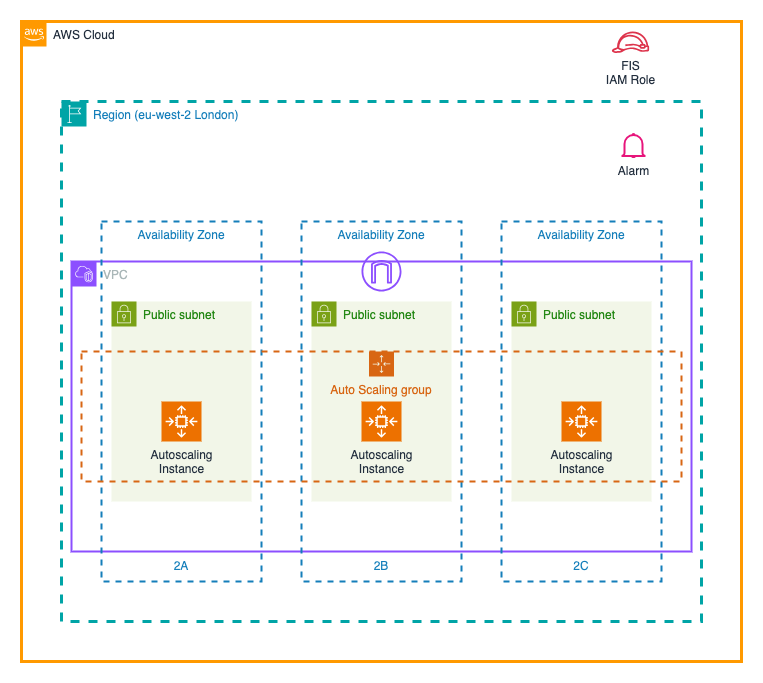

# Step 03 - Ensuring our service survives.

In the previous experiment, we improved our resilience, cutting down the time it takes to recover from a failure. However, we can still improve this further by ensuring that our service can survive even
if some of the servers die or are stopped.

## Building our infrastructure.
This time rather than having a single server in the autoscaling group, we're going to have multiple servers spread across multiple availability zones. This means that if an availability zone fails, we still have servers running in the other availability zones.

Our new architecture will look like this:



To deploy our infrastructure, make sure we're in the `step03` directory before running the command `terraform init`, and then build our service with the command `terraform apply --auto-approve --var-file ../common/common.tfvars`. This will show the output as the infrastructure is created, completing with output looking something like:

```
Apply complete! Resources: 6 added, 0 changed, 0 destroyed.

Outputs:

elb_url = "http://step03-funky-elb-2009186052.eu-west-2.elb.amazonaws.com"
```

As alway, lets try opening that url and make a note of the instance id. This time, if you refresh the page, you should see the instance changing (it might take a couple of refreshes).

## Creating an experiment
This time, we're going to add a couple of new steps to the experiment.

We're going to start similar to the previous experiment, by creating a new template. Let's revisit the FIS Experiment templates in the AWS Console (either search for FIS, or use the link https://eu-west-2.console.aws.amazon.com/fis/home?region=eu-west-2#ExperimentTemplates) and then choose `Create an experiment template`.

Let's go with these steps:
1. Specify that we're going to create an alarm targeting just our account.
1. Provide a description for the template, such as `Stop step02 EC2 instance`, and add a name, something including your panda name at the end to make it easier to identify.
1. Create an action; provide a name, and then choose either to either stop or terminate the ec2 instances. Click `save`
1. Click `Add action` again. Add a new name, then for the action, choose `aws:fis:wait`. Next specify that we'll start the action after our first one by choosing the name of the first step from the `Start after` dropdown. Set the duration to `3 minutes` and click `save`.
1. Finally, click `Add action` again, provide a new name, and again choose either to stop or terminate the ec2 instances, set this start after the pause action. Make sure the targets are set to the same as the first action. Click `save`.
1. Select the target; we're going to filter on our instance tags again, so choose `Resource tags, filters and parameters`, and add the tags `Panda` and `Experiment` again, this time using `step03` as the `Experiment` value. For the first run of the experiment, we're going to ask it to kill 2 of the 3 available servers, so change `Selection mode` to `count` and set the value to `2`. Click `save`.
1. Use the role we created at the start, so click on `Use an existing IAM role` and select the role that starts with your panda name.
1. This time, we're going to set a condition that will stop the experiment. We've already created an alarm that starts with the panda name that will alert if more than a certain number of errors are generated by the loadbalancer. So click on the dropdown next to `Stop conditions` and select the alarm that starts with your panda name.
1. Click on the `Create an experiment template` button, and in the warning field, enter `create` and then click the `Create an experiment template` button.

So this time, we generated an experiment we can use to check that if we lose a couple of servers, our service will still be available.

This time, for our alarm to generate an alert, we need to create traffic going through the load balancer. We'll need to run the following script in a server
```bash
while :
do
    http_code=$(curl -s -o /dev/null -w "%{http_code}" http://step03-funky-elb-591817578.eu-west-2.elb.amazonaws.com)
    if [ $http_code -eq 200 ]; then
        printf "."
    else
        printf "X"
    fi
    sleep 0.5
done
```
Replace *_load_balancer_url_* with the url of the load balancer, and run the script in a terminal.

Let's run the experiment by clicking on `Start experiment`, and the same on the next page before entering `start` in the warning field and clicking `Start experiment`.

This is going to test that we can survive 2/3's of the servers in our test service failing, and the experiment should complete in about 3 minutes.

## Re-running our experiment
But how do we know whether the experiment is actually valid - let's repeat it, but this time we'll stop all servers.

Firstly, check the `instances` in the AWS console and make sure that all of our 3 instances are up and running as we'd expect. We can filter on our panda name to check
just our servers.

Once we're happy we have all of the servers, let's head back to the `Experiment Templates` in FIS. Rather than creating a new experiment let's modify the one we just ran. Find the template in the list, and click on the template ID. In the `Actions` dropdown at the top of the page, select `Update`. 

Click on the `Targets` section, and change the `Selection mode` to `All` or update the `Number of resources` to 3. Click `Save`. Scroll to the bottom of the template and click `Update an experiment template`. Once the template details are shown, click on `Start experiment` in the top right corner, and confirm you want to `Start`.

If you've stopped the script we were running in the terminal, restart it, then in the AWS Console, restart the experiment. After 2 or 3 minutes, the alarm should trigger and stop the experiment.
