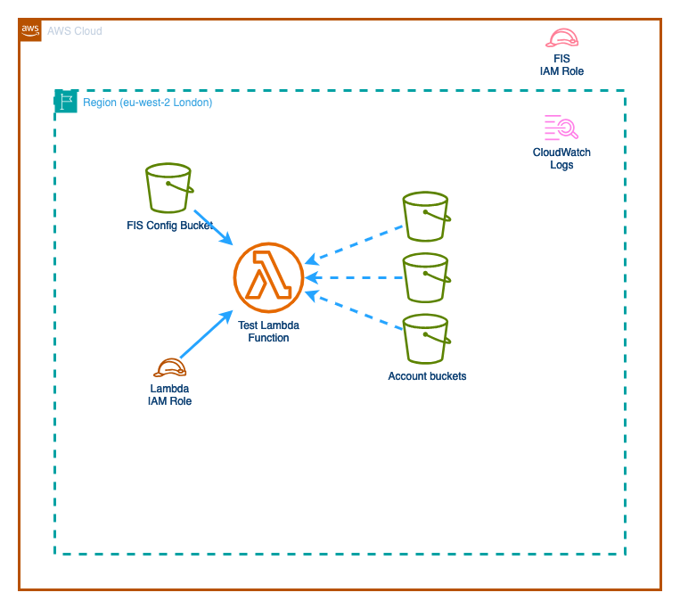

# Step 04 - Testing Lambdas

In October '24, Amazon [announced](https://aws.amazon.com/about-aws/whats-new/2024/10/aws-lambda-fault-injection-service-actions/) that FIS could now interact with Lambdas. So let's see how we can use this to test our Lambdas.

## Building our infrastructure
For this step, we're going to create a Lambda function that simply lists all of the buckets in our account. We'll then create an experiment that will inject a fault into the Lambda function, causing it to fail.

The infrastructure for this step looks like this:



As before, lets make sure we're in the `step04` directory, and run the command `terraform init` to initialise our environment. Then we can run `terraform apply --auto-approve --var-file ../common/common.tfvars` to build our infrastructure. This will output the resources as it builds, and the output should finish with something like:

```
aws_iam_role_policy_attachment.lambda_fis_policy_attachment: Creation complete after 0s [id=funky_fis_lambda_role-20241122162204839700000003]
aws_lambda_function.this: Still creating... [10s elapsed]
aws_lambda_function.this: Creation complete after 10s [id=funky_step04_lambda]

Apply complete! Resources: 12 added, 0 changed, 0 destroyed.

Outputs:

fis_experiment_rolename = "funky_step04_fis_iam_role"
lambda_name = "funky_step04_lambda
```

## Testing our Lambda
Let's start by looking at how our lambda runs normally. To do this, we need to login to our AWS console and navigate to the Lambda service via https://eu-west-2.console.aws.amazon.com/lambda/home?region=eu-west-2#/functions . We should see our lambda function listed matching the name in the output above, and we can click on it to open the function.

In the `Code` section, we can see the code that we've uploaded. This is a simple function that lists all of the buckets in our account. To test this, we first need to create an event - in this case, we're not worried about the date we pass in, so we'll create a demo event by clicking on the `Create test event` button. We'll need to add an event name, such as `test`, and then click `Save`. Once we get confirmation that the event have been saved, we can close the notification and the event tab, click on the blue `Test` button at the side of the page, and choose the event we just created in the dropdown at the top of the code section.

In the output section of the lambda console, we'll see the output of the lambda function, which should contain a list of buckets in our account along with some statistics about the invocation of the lambda function.

### Creating an experiment.
Now that we know our lambda works, let's see how we can use FIS to test it. In the search box at the top of the page, enter `FIS` and in the results, in a new tab open 'AWS FIS'. Alternatively, open a new tab and enter the url https://eu-west-2.console.aws.amazon.com/fis/home?region=eu-west-2#Home. Once we're in the FIS console, click on 'Experiment templates' in the left hand menu, and then click on the `Create an experiment template` button.

Let's go with these steps:
1. Specify that we're going to create an alarm targeting just our account.
1. Provide a description for the template, such as `Delay lambda invocation`, and add a name, something including your panda name at the end to make it easier to identify. Click `Next`.
1. Create an action; provide a name such as `delay_lambda` (:warning: remember no spaces!), and in the action choose `aws:lambda:invocation-add-delay`. In the `Duration` field, enter 3 minutes, and set the Startup delay to 35000 . Click `save`.
1. Select the target; in this case we want to make sure we're selecting a `aws:lambda:function`. Then click on `Add new ARN`, and in the dropdown selector, choose the lambda function we just created. Click `save`.
1. Now that we've set our action to introduce a delay in the startup of our lambda, and chosen the lambda, we want to specify the IAM role to use. Click on `Use an existing IAM role` and select the role that starts with your panda name and ends with `step04_fis_iam_role`. Then click `Next`.
1. On the optional page, scroll to the bottom and click `Next`. Review the details you've entered to make sure they match what we've listed in the previous steps. If you've missed something , use `Previous` to go back and correct it. 
1. Click on the `Create an experiment template` button, and in the warning field, enter `create` and then click the `Create an experiment template` button.

## Running our experiment
So, we've just created a template that will run for 3 minutes and if our lambda is invoked during that period, it will be delayed by 35 seconds. Let's run the experiment by clicking on `Start experiment`, and the same on the next page before entering `start` in the warning field and clicking `Start experiment`.

With the experiment running, we can head back to the lambda console and invoke our function again by clicking `Test` and selecting the `test` event. This time, we should see that the lambda takes longer to run, as the delay is introduced. In this case, the lambda has been configured to have a timeout period of 30 seconds; this means that the lambda will timeout before it completes, and we'll see an error in the output similar to below:

```
Response:
{
  "errorType": "Sandbox.Timedout",
  "errorMessage": "RequestId: 206daef1-98f9-492c-a72f-b3cd82fe1d15 Error: Task timed out after 30.00 seconds"
}
```

## Ensure normal functions!
We set the experiment to run for 3 minutes, so if we wait for the period to expire or for the experiment to complete in the FIS console, we can re-run our lambda and it should run as normal.

## So how did this work.
When we deployed the lambda, we configured it to use a layer provided by AWS. This contains software that interacts with FIS. If we look at the function in the lambda console, we can see this layer in place. 

We also added some environment variables to the lambda function, which are used by the layer to interact with FIS. These are:
* `AWS_FIS_CONFIGURATION_LOCATION` - this points to an S3 bucket that we deployed through the terraform script. When the experiment runs, it uses this to share date with the lambda layer to co-ordinate the experiment actions.
* `AWS_LAMBDA_EXEC_WRAPPER` - this should be set to `/opt/aws-fis/bootstrap` and specifies where the code for the layer can be found.


## Cleaning up
Once you've completed the experiment, you can clean up the resources by running the command `terraform destroy --auto-approve --var-file ../common/common.tfvars`. This will remove the resources we've created in this step.

<br />
<br />

---
Return to the main [README](../../README.md) file